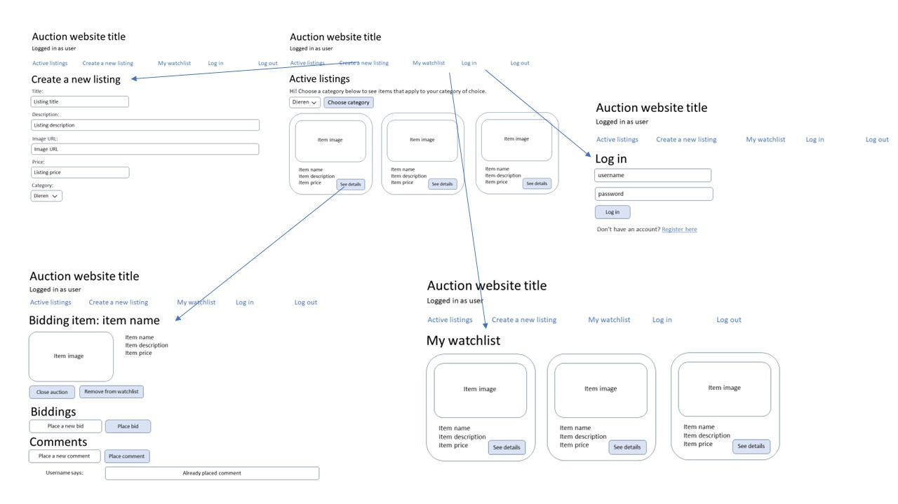
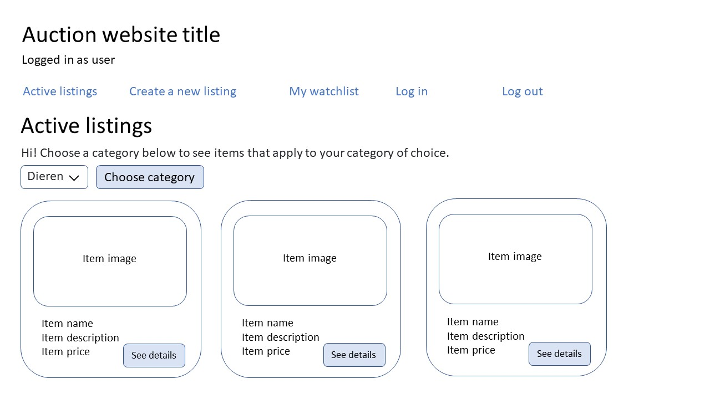
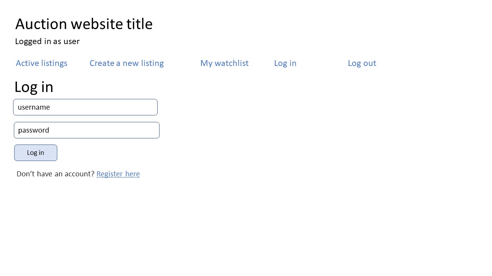
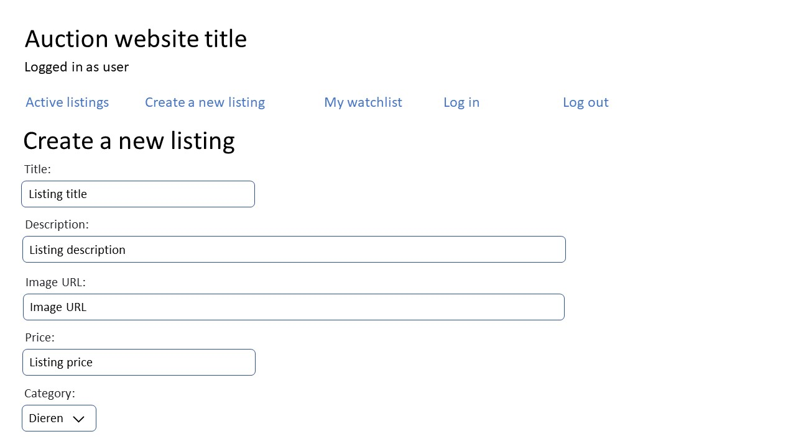

# Auction website application - Laura Outhuis
This application is an online auction website, where users can create profiles, 
add listings to the auction and bid on items!

## Getting Started
To use this application, download the repository and run python3 manage.py runserver. 

  
  
  
  
  
