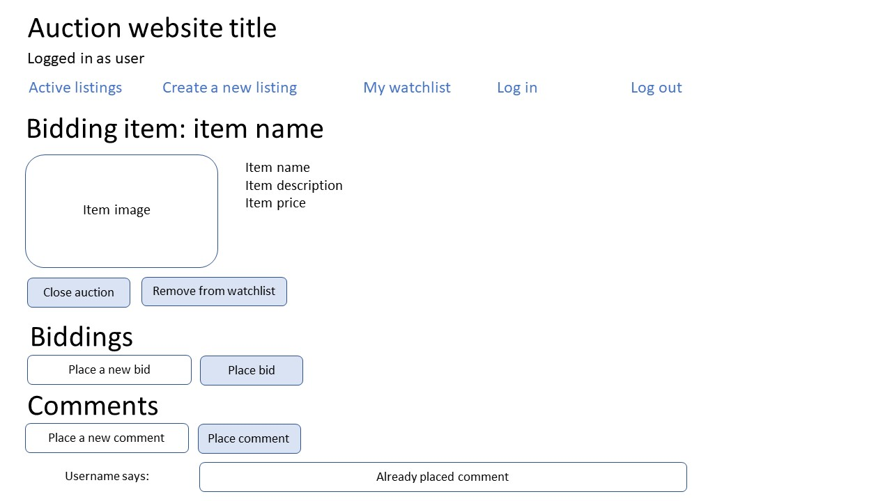

# Auction website application - Laura Outhuis
This application is an online auction website, where users can create profiles, 
add listings to the auction and bid on items!

## Getting Started
To use this application, download the repository and run python3 manage.py runserver. 

### Relationship between the pages
 
Deze pagina beschrijft de verschillende relaties tussen de pagina's en welke interacties er mogelijk zijn. 

  
Deze pagina heeft informatie uit de database nodig over de verschillende listings (+ informatie over listing, zoals de naam en omschrijving) en de categorieën (voor het dropdown menu om te filteren op categorie.  

Deze pagina heeft informatie uit de database nodig over de bestaande gebruikers, zodat de gebruiker geen username kan kiezen die al in de database voorkomt.  

  
Deze pagina heeft informatie uit de database nodig over de verschillende categorieën waar een listing onder kan vallen.  

 
Deze pagina heeft ook de informatie uit de database nodig over de verschillende listings om ze te kunnen weergeven en bijhouden welke items in de watchlist staan.  

Deze pagina heeft informatie uit de database nodig over de listing die wordt weergeven en de biedingen en comments die eventueel eerder al zijn uitgebracht. Ook moet de bieding kunnen worden gesloten en moeten iets kunnen worden toegevoegd aan een watchlist als deze er nog niet in staan of worden verwijderd als ze al in de watchlist staan.
