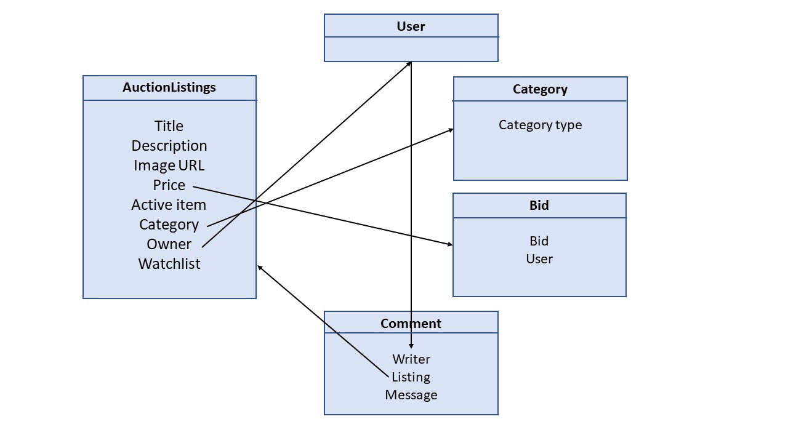

# Design Commerce assignment  
## Laura Outhuis (s14687887)  

## Wat ga ik maken en hoe gaat het eruit zien  
Het doel van deze opdracht is het maken van een veilingwebsite. Hier kunnen gebruikers zich registreren en inloggen om zelf veilingitems toe te voegen en op veilingitems te bieden. De gebruikers kunnen veilingitems volgen door deze toe te voegen aan hun watchlist. Wanneer een gebruiker zijn veilingitem wilt sluiten zal een bieder die op dat moment het hoogst uitgebrachte bod heeft het item winnen. 

## Technical challenges  
Het lastigste aan deze opdracht gaat denk ik het implementeren van de database zijn, aangezien ik hier nog nauwelijk ervaring mee heb. Hiervoor heb ik als voorbereiding het SQL college gekeken en de notes doorgenomen. 

## Schetsen  
Zie afbeeldingen in de README.md

## Workflow: wat moet de gebruiker allemaal kunnen?  
x De gebruiker moet zich kunnen registreren via een registreer knop  
x De gebruiker moet kunnen inloggen via een registreer knop  
x De gebruiker moet kunnen uitloggen via een registreer knop  
x Niet-ingelogde gebruikers kunnen de items kunnen veilingitems bekijken via de active listingspagina.  
x De gebruiker moeten items kunnen filteren op basis van categorie  
x Een ingelogde gebruiker moet kunnen bieden op een listing item  
x Een ingelogde gebruiker moet zelf items op de listing kunnen zetten  
x Een ingelogde gebruiker moet items kunnen toevoegen aan de watchlist  
x Een ingelogde gebruiker moet zijn veilingitem kunnen sluiten  

## Models Class diagram
  
